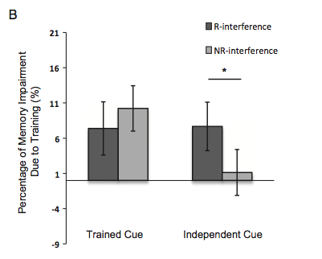

### Article ID: 1234
#### Pilot: Tom Hardwicke
#### Co-pilot: Tom Hardwicke  
#### Start date: 02/09/2017
#### End date: 02/09/2017 

--------

#### Methods summary: 

On Day 1, 48 Chinese word pairs (e.g., wisdom-plane) were displayed sequentially. Each target ('X' e.g., plane) was paired with two different cues ('A-X' and 'B-X', e.g., wisdom-plane and gardner-plane). Participants completed several test phases (with and then without feedback) until they reached 100% accuracy.

On Day 3, the 24 A-X pairs were divided into 3 subsets of 8: reactivation plus interference (R-INT), interference with no reactivation (NR-INT), and nothing (baseline control). The reactivation phase involved an old/new recognition test, during which one cue A word (R-INT condition) or one lure word (NR-INT and baseline condition) was shown alone on the screen for 2 s, and participants judged whether they had seen it in the previous learning session. The interference phase involved the R-INT and NR-INT A cues being presented with 3 novel words.

On Day 4, all the 48 cue words were presented consecutively on the screen. Participants typed the corresponding target words originally paired in the learning session into the computer. The order of testing for the 6 groups was randomized within participants.


#### Target outcomes: 

For this article please focus on the findings of Experiment 1. You should attempt to reproduce all of the outcomes reported in section 2.2, specifically this paragraph (p.126):

> Memory impairment was calculated by subtracting the recall accuracies in the control conditions from those in the correspond- ing experimental conditions (Fig. 1A). Because no significant difference was found in memory performance between the control condition of trained-cue retrieval and that of independent-cue retrieval in the ensuing experiments (p > 0.05), the recall accuracies in both control conditions were averaged and then used as a baseline for subtraction in the following analysis. Memory impairment was examined by a 2 (cue type: trained cue vs. independent cue) 2 (interference type: reactivation-coupled interference (R-interference) vs. non-reactivation-coupled interference (NR-interference)) repeated measures ANOVA. Results (Fig.2B) showed that, neither the main effect of cue type (F(1, 43) = 3.27, p > 0.05, MSE = 0.03, g2p = 0.07) nor that of interference type (F(1, 43) = 0.53, p > 0.05, MSE = 0.03, g2p = 0.01) were significant, but their interaction effect was significant (F(1, 43) = 4.43, p < 0.05, MSE = 0.02, g2p = 0.09). Investigations on the simple effects showed that, contrary to the usual view (Chan & LaPaglia, 2013), R-interference did not result in more severe memory impairments than NR-interference (t(43) = 0.75, p > 0.05) for trained-cue retrieval. In contrast, more memory impairment of the target words was found in the R-interference condition compared to the NR-interference condition for independent-cue retrieval (t(43) =  2.24, p < 0.05), indicating that memory impairment by R-interference was not restricted to the cues directly interfered.

______  

```{r global_options, include=FALSE}
knitr::opts_chunk$set(echo=TRUE, warning=FALSE, message=FALSE)
```

## Step 1: Load packages

```{r}
library(tidyverse) # for data munging
library(magrittr) # for cleaner code
library(haven) # import and export 'SPSS', 'Stata' and 'SAS' Files
library(readxl) # import Excel files
```

## Step 2: Load data

```{r}
d_raw <- read_excel('data/data_1234_manualClean.xlsx', sheet = 1)
```

## Step 3: Tidy data

Some information embedded within the data file (data_1234.xls):

> Test performance (1 correct; 0 incorrect)

> conditions (1-trained R-inter; 2-trained NR-inter; 3-control; 4-independent R-inter; 5-independent NR-inter; 6-control)

A great deal of manual munging was required to get the data into Tidy format. Now we we will make *id* a factor, replace the numeric *conditions* values with named factors. We will also call this *condition* rather than conditions (personal preference).

```{r}
d.tidy <- d_raw %>%
  mutate(id = factor(id),
         condition = factor(conditions),
         condition = recode(condition, 
                             "1" = "trained_R_INT",
                             "2" = "trained_NR_INT", 
                             "3" = "trained_CONT", 
                             "4" = "independent_R_INT", 
                             "5" = "independent_NR_INT", 
                             "6" = "independent_CONT")) %>%
  select(id, condition, score)
```

Check the data is in Tidy format:

```{r}
head(d.tidy)
```

Let's just do a quick sanity check to see that everything looks as it should. The paper says that in Experiment 1 there were:

> Forty-four participants

How many unique participants are there in our data?

```{r}
length(unique(d.tidy$id))
```

**OK** The number of participants matches.

For each participant (P) there should be 8 values in each condition (48 cue words, divided into 24 trained and 24 independent, each divided into 3 subsets: R, NR, and control).

```{r}
d.tidy %>%
  group_by(id, condition) %>%
  summarise("n_observations" = n())
```

**OK** The number of observations per condition matches.

## Step 4: Run analysis

### Pre-processing
It looks like some initial pre-processing steps required to calculate the dependent measure "memory impairment".

> Memory impairment was calculated by subtracting the recall accuracies in the control conditions from those in the corresponding experimental conditions (Fig. 1A). Because no significant difference was found in memory performance between the control condition of trained-cue retrieval and that of independent-cue retrieval in the ensuing experiments (p > 0.05), the recall accuracies in both control conditions were averaged and then used as a baseline for subtraction in the following analysis

Let's first calculate accuracy (presumably proportion correct) at the participant level for each condition.

```{r}
d_sum <- d.tidy %>% 
  group_by(id, condition) %>%
  summarise("proportionCorrect" = sum(score)/length(score))
```

We will convert to wide format to make the calculations easier.

```{r}
d_sum_wide <- d_sum %>% 
  spread(condition, proportionCorrect)
```

Let's first check this claim:

> no significant difference was found in memory performance between the control condition of trained-cue retrieval and that of independent-cue retrieval in the ensuing experiments (p > 0.05)

The statistical test used is not reported. A paired t-test seems reasonable for this situation. Let's try that:

```{r}
t.test(d_sum_wide$trained_CONT, d_sum_wide$independent_CONT, paired = T)
```

**OK** As the article suggests, there is no significant difference between the trained and independent control conditions.

Now we calculate memory impairment scores using the average (presumably mean) of the two control conditions. First the averaging (we will call the new variable 'baseline'):

```{r}
d_sum_wide <- d_sum_wide %>%
  mutate(baseline = mean(c(trained_CONT, independent_CONT)))
```

Now calculate the memory impairment scores for each condition by subtracting the baseline:

```{r}
d_sum_wide <- d_sum_wide %>% 
  mutate(trained_R = trained_R_INT - baseline,
         trained_NR = trained_NR_INT - baseline,
         independent_R = independent_R_INT - baseline,
         independent_NR = independent_NR_INT - baseline)
```

Now go back to long format:

```{r}
d_sum_long <- d_sum_wide %>% 
  select(id, trained_R, 
           trained_NR, 
           independent_R, 
           independent_NR) %>%
  gather(condition, score, 
         c(trained_R, 
           trained_NR, 
           independent_R, 
           independent_NR),
         factor_key = TRUE)
```


### Descriptive statistics

Group level impariment scores are reported in Fig. 2 of the original article:



> Fig. 2. (A) Timeline of Exp. 1. (B) Percentages of memory impaired in different conditions relative to the baseline condition in Exp. 1. R-interference and NR-interference caused comparable memory impairment in trained-cue retrieval, while R-interference caused significantly more memory impairment than NR-interference did in independent-cue retrieval. * p < 0.05 (two-tailed t test); error bars, SEM.

First let's define a function for calculating standard error:
```{r}
std_error <- function(x) sd(x)/sqrt(length(x))
```

Now let's calculate group level impariment scores:

```{r}
d_sum_long %>%
  group_by(condition) %>%
  summarise(impairment = mean(score),
            se = std_error(score))
```

**OK**. From eyeballing the figure, it looks like these values are similar.

### Inferential statistics

The article reports that:

> Memory impairment was examined by a 2 (cue type: trained cue vs. independent cue) 2 (interference type: reactivation-coupled interference (R-interference) vs. non-reactivation-coupled interference (NR-interference)) repeated measures ANOVA.

Let's try that out. First we need to break down condition by cue type (trained/independent) and reactivation type (reactivation/no-reactivation).

```{r}
forAOV <- d_sum_long %>%
  separate(condition, into = c("cue", "react"), sep = "_") %>%
  select(id,cue,react,score)
```

```{r}
aov.out <- aov(score ~ cue*react + Error(id/(cue*react)), data=forAOV)
```

In the article, the results of the anova are reported as:

> Results (Fig.2B) showed that, neither the main effect of cue type (F(1, 43) = 3.27, p > 0.05, MSE = 0.03, g2p = 0.07) nor that of interference type (F(1, 43) = 0.53, p > 0.05, MSE = 0.03, g2p = 0.01) were significant, but their interaction effect was significant (F(1, 43) = 4.43, p < 0.05, MSE = 0.02, g2p = 0.09). 

Here are the results of our anova:
```{r}
summary(aov.out)
```

**OK**. We have successfully reproduced the reported outcomes of the anova.

## Step 5: Conclusion

Results tally:

* **OK** (i.e., no discrepancy): 5
* **MINOR NUMERICAL ERROR**: 0
* **MAJOR NUMERICAL ERROR**: 0
* **DECISION ERROR**: 0

If there were any major numerical or decision errors then this reproducibility check was a *failure*. If there were only minor numerical errors, or no discrepancies, then this reproducibility check was a *success*.

OVERALL CONCLUSION: **SUCCESS**
